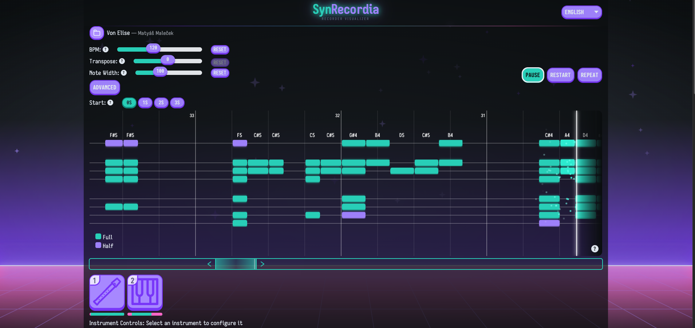

# SynRecordia

[](#)
[](https://buymeacoffee.com/huuthang.le)

<p align="center">
  
</p>

<p align="center">
  Try the live <a href="https://synrecordia.netlify.app/">demo</a> right in your browser.
</p>

SynRecordia is an interactive browser-based **soprano recorder** visualizer and sampler built with React. Inspired by [ Synthesia](https://synthesiagame.com/), it pairs a scrolling note timeline with real fingering diagrams and sampled audio playback so you can see exactly which holes to cover while you listen. Everything runs client-side — no server required — using Tone.js for audio and PIXI.js for visuals.

The architecture is instrument-agnostic by design: adding support for another fingered instrument (ocarina, tin whistle, guitar — you name it) is a matter of dropping in a new sample set and a sampler implementation.

<p align="center">
  <a href="https://reactjs.org/"></a>
  <a href="https://tonejs.github.io/"></a>
  <a href="https://pixijs.com/"></a>
</p>

---

## Core ideas

- **Visual learning + listening** — a scrolling timeline draws per-note fingering diagrams and labels in sync with playback, so you always know which holes to cover.
- **Sampled recorder** — real Philharmonia flute samples across five dynamics (pianissimo → forte), switchable on the fly.
- **Extensible instrument layer** — the sampler abstraction is generic; new instruments slot in without touching the visualizer or player.
- **Lightweight, web-first** — pure client-side: no backend, no plugins, just a browser.

---

## What's done

- **Note visualizer** — timeline renders fingering graphics, note labels, glow effects, and particles for active notes. Smooth scrolling with beat interpolation keeps the view locked to playback without snapping. (`src/components/Visualizer.jsx`)
- **Real-time playback** — play / pause / restart, BPM control, mouse and touch scrubbing, repeat/loop, and per-track instrument selection. Tone.js handles sample scheduling. (`src/components/Player.jsx`)
- **Instrument configuration** — per-instrument volume and variant/version controls. A packed sampler abstraction in `src/libs/packedSampler/` drives instrument-specific implementations (`piano.js`, `recorder.js`). Samples live under `public/samples/<instrument>/<version>/index.json`.
- **Play mode** — real-time practice mode via microphone (autocorrelation pitch detection) or Web MIDI API. For each note in the score, the system checks whether the correct pitch was played within a rolling acceptance window; if not, playback pauses at that note's position and waits. Works with any instrument that exposes a MIDI note number (recorder fingering chart, MIDI keyboard, etc.).

---

## What's planned

- **MIDI import** — load standard MIDI files in the browser and convert them to the internal song format.
- **Play mode scoring / feedback** — visual hit/miss overlay, per-note accuracy stats, and an end-of-song practice summary.
- **More instruments** — ocarina, tin whistle, guitar, and other instruments the author loves. The sample pipeline scripts already support any instrument folder.

---

## Known limitations

### Play mode acceptance window

Play mode uses a simple time-based check: when the song reaches a note's beat position, it looks back up to **1 beat** (`ACCEPT_WINDOW_BEATS`) to see whether the correct MIDI pitch was played. This approach is intentionally minimal and has one practical consequence:

- **The window is beat-relative, not tempo-relative.** At slow tempos 1 beat is a long time (e.g. 2 s at 30 BPM); at fast tempos it is short (e.g. 0.3 s at 200 BPM). If a piece is very fast you may need to play slightly ahead of the beat to stay inside the window.
- **Mic detection adds ~33 ms of onset latency** (2 consecutive frames at 60 fps must agree on the same pitch before the onset is recorded). Playing clearly and without hesitation keeps this imperceptible in practice.
- **Same adjacent notes share the same onset.** If the score has two identical pitches back-to-back and you hold through both, both are accepted from the single onset as long as the gap between them is ≤ 1 beat. For wider gaps the note must be replayed.

The constant `ACCEPT_WINDOW_BEATS` in `src/hooks/usePlayMode.js` can be increased if you find the window too tight.

---

## Quick start

```bash
# Install dependencies
npm install

# Start the development server
npm run dev

# Build for production
npm run build
```

---

## Samples & attribution

- **Salamander Grand Piano V2** — Alexander Holm. Licensed [CC BY 3.0](http://creativecommons.org/licenses/by/3.0/).
- **Philharmonia samples** — sourced from [Philharmonia](https://philharmonia.co.uk/resources/sound-samples/). Free to use but **must not be redistributed as-is** from this repository. Please download them from the official site and place them locally as described below.

---

## Installing recorder (flute) samples

The recorder instrument uses flute samples from Philharmonia. Because of their redistribution policy the audio files are not committed to this repo — you download them once and run a small pipeline of scripts to get them ready. The whole process takes just a few minutes.

> **Requirements:** [Node.js](https://nodejs.org/) 18+ and [FFmpeg](https://ffmpeg.org/download.html) must be installed and available on your `PATH`.

---

### Step 1 — Download and place the samples

1. Visit the Philharmonia sound samples page:
   **https://philharmonia.co.uk/resources/sound-samples/**
2. Find the **flute** pack under Woodwinds and download it.
3. Locate (or create) a `flute.zip` from the downloaded contents and copy it into the project:

```bash
cp /path/to/downloaded/flute.zip public/samples/recorder/
```

---

### Step 2 — Organise the files

Run the organiser script from the project root:

```bash
node scripts/prepare-recorder.mjs
```

This script will:

- Extract `flute.zip` into a temporary directory.
- Keep only files whose name contains an underscore-delimited numeric index equal to `1` (e.g. `flute_A4_1_forte_normal.mp3`). Other index variants are discarded.
- Read the dynamic token from the filename (`forte`, `mezzo-forte`, `mezzo-piano`, `pianissimo`, `piano`) and move each file into the matching sub-folder under `public/samples/recorder/`.
- Run a reclassification pass to catch any misfiled samples.

After this step your folder should look like:

```
public/samples/recorder/
  forte/
    flute_A4_1_forte_normal.mp3
    flute_A#4_1_forte_normal.mp3
    ...
  mezzo-forte/
    ...
  piano/
    ...
  index.json
```

---

### Step 3 — Tame the loudness

Raw flute samples — especially in the upper register — can be genuinely ear-splitting. Before extending them it is worth normalising their peak level so everything sits at a comfortable, consistent volume.

**First, have a look at what you're dealing with:**

```bash
node scripts/audio-loudness-helper.mjs public/samples/recorder --list
```

This prints the true-peak level (dBFS) of every file, colour-coded by severity. You will likely see the high notes glowing red.

**Then fix them all in one pass:**

```bash
node scripts/audio-loudness-helper.mjs public/samples/recorder --fix --target -20
```

`--target -20` sets every file's peak to −20 dBFS — loud enough to be present in the mix but with plenty of headroom. Feel free to adjust to taste; anywhere between −18 and −24 is a reasonable range.

> **Tip:** add `--dry-run` to preview what would change without touching any files.

---

### Step 4 — Extend the sample duration

Philharmonia samples are short — typically around one second per note. That is fine for staccato passages, but sustained notes will cut off awkwardly. The `extend-samples` script finds the stable sustain body of each note, phase-matches a seamless loop point, and repeats it with equal-power crossfades until the sample reaches your target duration.

**Recommended invocation:**

```bash
# Safe option — writes extended files to a separate folder
node scripts/extend-samples.mjs public/samples/recorder \
  --min-duration 6 \
  --fade-out 2 \
  --quality 5 \
  --output-dir public/samples/recorder-extended
```

| Option | Recommended | Why |
|---|---|---|
| `--min-duration 6` | 6 s | Covers most held notes without wasting space |
| `--fade-out 2` | 2 s | Long, gentle fade avoids an abrupt cutoff |
| `--quality 5` | 5 | A good balance between file size and audio quality (MP3 VBR ~130 kbps) |
| `--output-dir` | separate folder | Non-destructive — originals are untouched |

Once you are happy with the results, you can point the app at the extended folder or swap it in for the originals:

```bash
# ⚠️  In-place mode overwrites the originals — make a backup first!
node scripts/extend-samples.mjs public/samples/recorder \
  --min-duration 6 \
  --fade-out 2 \
  --quality 5 \
  --in-place
```

> Use `--dry-run` at any time to preview what the script would do without writing any audio.

**Other useful options:**

```bash
# Process only specific dynamics
--versions forte,mezzo-forte

# Widen the phase-matching search window (helps with unusual samples)
--phase-window 0.06

# Adjust the loop crossfade length
--crossfade 0.08
```

---

### Full pipeline — quick reference

Here is the complete sequence from a fresh download to a ready-to-use sample set:

```bash
# 1. Place the zip
cp /path/to/flute.zip public/samples/recorder/

# 2. Organise into dynamic folders
node scripts/prepare-recorder.mjs

# 3. Normalise peak loudness to a comfortable level
node scripts/audio-loudness-helper.mjs public/samples/recorder --fix --target -20

# 4. Extend short samples (writing to a separate folder for safety)
node scripts/extend-samples.mjs public/samples/recorder \
  --min-duration 6 \
  --fade-out 2 \
  --quality 5 \
  --output-dir public/samples/recorder-extended

# 5. If you are happy, promote the extended folder to replace the originals
#    (skip this if you prefer to keep both)
rm -rf public/samples/recorder-extended-backup   # clean up any old backup
mv public/samples/recorder public/samples/recorder-backup
mv public/samples/recorder-extended public/samples/recorder
```

That's it — fire up the dev server and enjoy smooth, full-length recorder playback across all dynamics and registers.